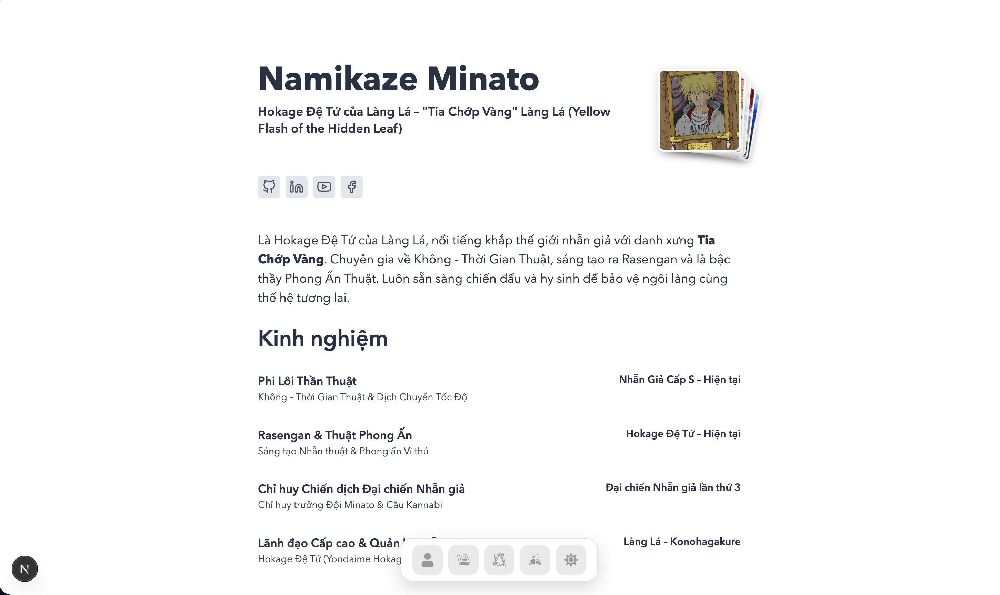
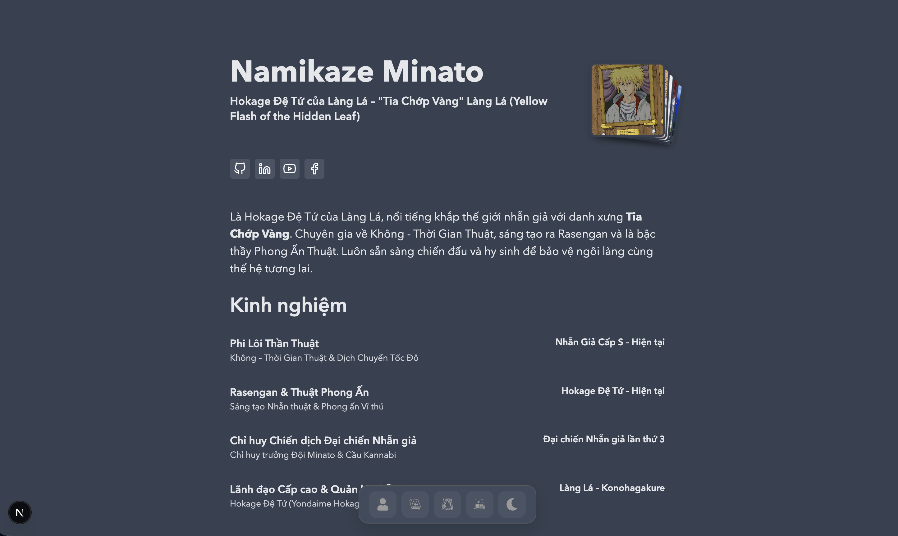

# Davipress

[](https://www.npmjs.com/package/davipress)
[](https://www.npmjs.com/package/davipress)
[](https://www.npmjs.com/package/davipress)

Davipress is a Markdown-first documentation and personal site framework built on Next.js App Router. It turns a `docs/` folder into a fast server-rendered website while keeping content, assets, navigation, and theme configuration in the project.

The default theme is designed for technical documentation and portfolio-style home pages. It includes a responsive navigation bar, light/dark mode, automatic sidebars, expandable home sections, GitHub contributions, Giscus comments, click-to-zoom images, syntax highlighting, math, and generated SEO files.

## Preview

### Light mode



### Dark mode



The complete reference site is available in [`demo/basic`](demo/basic).

## Quick start

### Requirements

- [Node.js](https://nodejs.org/) 20.9 or newer
- npm 10 or newer is recommended

### Create a project

Create an empty directory, initialize npm, install Davipress, and generate the starter files:

```bash
mkdir my-docs && cd my-docs
npm init -y
npm install davipress@latest
npx davipress init
npm run dev
```

Open `http://localhost:3000`, then edit `docs/index.md`. Add `docs/guide/getting-started.md` to create the `/guide/getting-started` route.

`npx davipress init` creates the starter content, `davipress.config.ts`, sample SVG assets, and the generated Next.js runtime. Existing files are preserved.

### Run without installing globally

Use `npx` or `npm exec` to run the CLI from the local project:

```bash
npx davipress@latest init
npx davipress dev

# Equivalent npm command
npm exec davipress -- dev
```

For a new project, install Davipress first so the generated `npm run dev` script can resolve the local CLI.

## Project structure

```text
my-docs/
  docs/                 Markdown and MDX content
  public/               Images, fonts, and other static assets
  davipress.config.ts   Site and theme configuration
  .davipress/           Generated Next.js application
```

`.davipress/` is generated by Davipress and should not be edited manually. It can be removed and recreated with `npm run clean` followed by another command.

## Configuration

```ts
import { defineConfig } from 'davipress'

export default defineConfig({
  title: 'My Documentation',
  description: 'A useful guide',
  url: 'https://example.com',
  lang: 'en',
  repository: {
    url: 'https://github.com/owner/repository',
    editLink: 'https://github.com/owner/repository/edit/main'
  },
  themeConfig: {
    nav: [{ text: 'Guide', link: '/guide' }],
    sidebar: 'auto',
    footer: 'Built with Davipress'
  },
  giscus: {
    enabled: true,
    repo: 'owner/repository',
    repoId: 'repository-id',
    category: 'Announcements',
    categoryId: 'category-id'
  }
})
```

Use `sidebar_position` and `sidebar_label` in frontmatter to control an automatic sidebar. An explicit sidebar can be supplied as a path map. Supported frontmatter includes `title`, `description`, `date`, `updated`, `draft`, `image`, `keywords`, `layout`, and `comments`.

## Home blocks

The home page supports optional structured blocks:

```md
:::davi:hero
title: Your name
description: Your role
social: github | https://github.com/you | GitHub
:::

:::davi:github-contributions
:::

:::davi:certifications
title: A certification
img: /images/certification.png
org: Organization
date: Jan 01, 2026
:::
```

Available blocks include `hero`, `avt`, `expand-list`, `github-contributions`, and `certifications`. The home parser uses the triple-colon block syntax shown above.

## Markdown and assets

Both `.md` and `.mdx` files are discovered. A file's path becomes its route: `index.md` maps to the directory route, while other filenames become routes. Static assets use normal Markdown paths:

```md

```

Davipress supports GitHub-flavored Markdown, tables, task lists, fenced code blocks, math delimiters, raw HTML, heading IDs, anchor links, KaTeX, server-side syntax highlighting, and click-to-zoom images.

## Generated files

During `dev`, `build`, and `start`, Davipress generates:

- `/rss.xml` from published files in `docs/posts`
- `/robots.txt` with the configured site URL and sitemap

Set `url` in `davipress.config.ts` to generate production-ready absolute links.

## Commands

```bash
npm run dev      # Start the development server
npm run build    # Create a production build
npm run start    # Serve the production build
npm run clean    # Remove generated files
```

The same commands are available as `npx davipress <command>`.

To run a specific published version:

```bash
npx davipress@0.1.3 init
npm install davipress@0.1.3
```

## Development

Clone the repository and install its dependencies:

```bash
git clone https://github.com/danqth/davipress.git
cd davipress
npm install
```

Build and test the package:

```bash
npm run build
npm test
```

Build or preview the reference demo:

```bash
cd demo/basic
npm run build
npm run dev
```

The `demo/` directory is a development example and is not included in the published npm package.